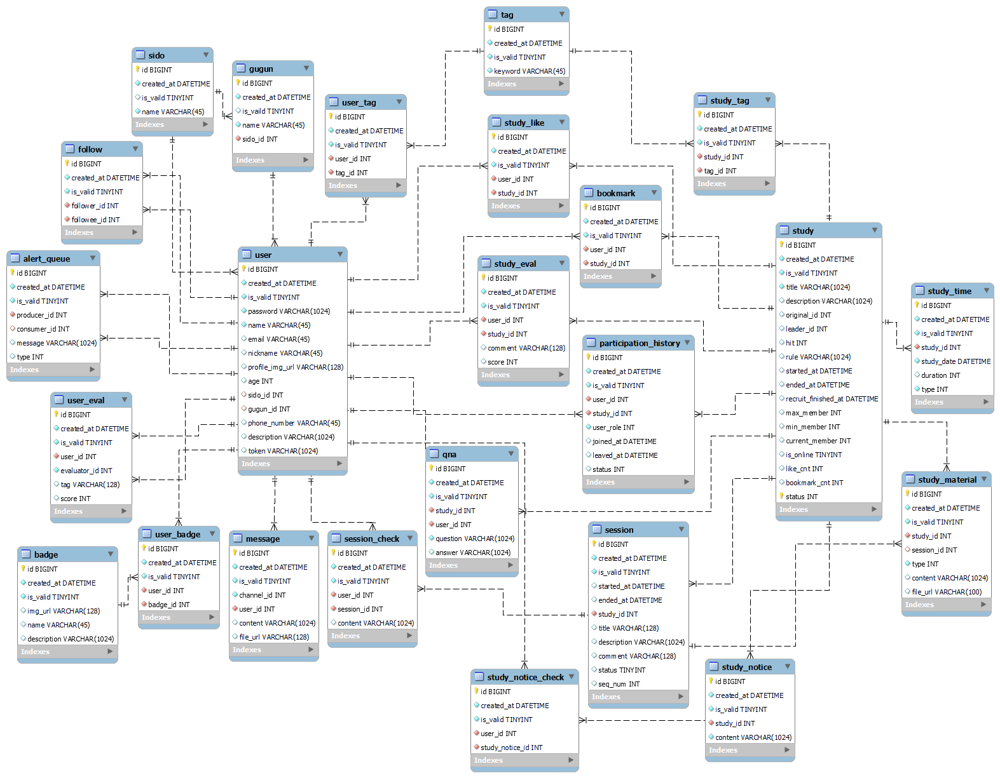
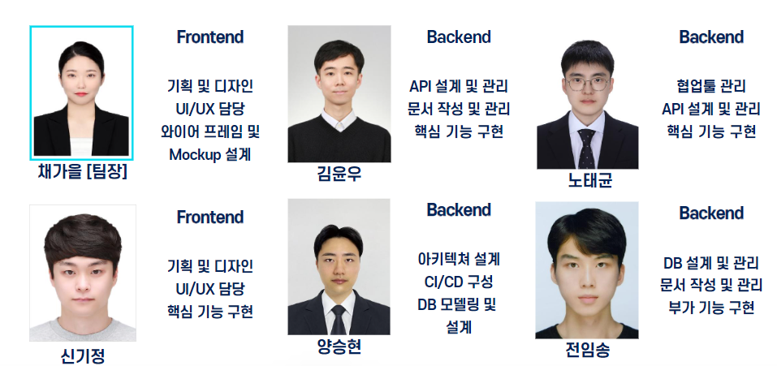

# ⛯ 프로젝트 진행 기간

2023.07.03 ~ 2023.08.18 (7주)

# ⛯ 서비스의 소개

당신의 삶이라는 항해 속에서 바람을 타고 나아가라. 모험하고, 꿈꾸고, 발견하라. -마크 트웨인-

자기계발이 중요한 덕목 중 하나가 된 오늘 날!
무언가에 도전해보고 싶은데 그것을 함께 할 팀원을 모집하기 힘들었던 적이 있으신가요?

저희 Lighthouse에서는 크루의 모집부터 계획, 커리큘럼 구성, 시간 조율, 소통, 일정관리를 도와 줄 뿐 아니라 선구자들의 항해일지까지 제공함으로서 등대와 같이 사용자들의 항해를 서포트합니다!

# ⛯ 개요

Lighthouse는 스터디에 참여하거나, 기본 제공되는 템플릿을 베이스로 스터디를 직접 만들거나, 이전에 다른 사람들이 진행했던 스터디의 템플릿을 활용할 수도 있는 스터디 플랫폼입니다.

스터디라 함은 결국 사람들과의 상호작용이 핵심요소이기 때문에 우리 Lighthouse는 SNS를 베이스로 해서 개발되었습니다.

Lighthouse에서는 이전의 노하우와 성공경험이 담긴 템플릿을 카피하여 사용할 수 있는 서비스를 제공하기 때문에 새로운 것에 도전하고 싶지만 배경 지식이 모자라거나, 스터디를 체계적으로 운영하는데에 도움이 필요한 사람들에게 도움이 될 것입니다. 또한, 유저에 따라 여러 평가요소가 있어 수준에 맞는 팀원을 찾기 어려운 스터디 진행자에게도 더 할 나위 없이 좋은 플랫폼일 것 입니다.

# ⛯ 주요 기능

## 🌟 스터디 생성 / 참가

- 관심 있는 분야의 스터디를 생성하거나, 자신에게 적합한 모집 중인 스터디를 검색, 비교하고 참가할 수 있습니다.
- 스터디의 제목으로 검색하거나, 토글을 통해 필터링을 할 수도 있습니다.

## 🌟 스터디 템플릿 포크

- 완료 된 스터디의 계획과 형식을 가져와 그대로 사용하거나 개량해 사용할 수 있습니다.
- 성공적인 선례를 통해 방향성을 제시 받음으로서 효율적으로 스터디를 진행할 수 있습니다.

## 🌟 채팅

- 스터디 별로 단체 채팅이 자동적으로 생성되어 스터디 원들과 빠른 의사소통이 가능합니다.
- 혹은 개인 메세지를 통해 타 유저와 의사소통할 수 있습니다.

## 🌟 평가

- 종료된 스터디와 함께 참여한 유저에 대한 평가를 할 수 있습니다.
- 스터디의 경우에는 `5점` 만점을 기준으로 점수를 부여할 수 있으며, 글로써 후기를 남길 수 있습니다.
- 유저의 경우 `성실성, 의지, 열정` 등의 5가지 요소를 10점 만점을 기준으로 점수를 부여하거나, 모두 0점을 주는 것으로 고발을 할 수 있습니다.

## 🌟 배지

- 평가로 받은 5가지 요소를 통해 자동적으로 발급되는 배지입니다.
- 올 0을 상습적으로 받은 악성 유저는 해적 배지를 받게 됩니다.

## 🌟 팔로우

- 스터디 진행 시 좋았던 유저를 팔로우할 수 있습니다.

# ⛯ 이렇게 구현했어요

## 🌟 서비스 화면

### 스터디 모집 공고 생성
1. 템플릿 둘러보기 페이지 이동

2. 템플릿 찾기

3. 템플릿 상세보기

4. 템플릿 수정

5. 모집 공고 업로드

---

### 스터디 모집 과정

1.	마이페이지의 신청 명단 조회

2.	신청한 사용자 프로필 조회

3.	신청 수락 및 스터디 시작

---

### 스터디 진행 및 마무리

1. 스터디 종료

2. 스터디 공유

3. 템플릿 리스트에 추가됨

---

### 스터디 신청

1. 스터디 모집 리스트 조회

2. 스터디 상세 조회

3. 스터디장에게 메시지 입력 후 신청

---

### 스터디 진행
1. 스터디 진행 페이지 조회

2. 채팅 조회

## 🌟 시스템 아키텍쳐

## 🌟 기술 스택

### BackEnd - Spring

- IntelliJ IDE
- Springboot 2.7.13
- Spring Data JPA
- Spring Web
- QueryDSL
- JWT
- WebSocket
- STOMP
- KAFKA & ZooKeeper
- Swagger 3.0.0
- MariaDB
- NoSQL (MongoDB)

### Frontend

- Visual Studio Code IDE
- React 18.2.0
- Redux 4.2.1
- React Router 6.14.2
- Sockjs 1.6.1
- ant design 5.7.2
- Figma

### CI/CD

- Jenkins
- Docker

### Storage
- AWS S3
- AWS CloudFront

## 🌟 프로젝트 산출물

  
ERD

    

       
      
    

  
시퀀스 다이어그램

    

       
      
    

## 🌟 협업 툴

- GitLab
  - 코드 버전 관리
- Jira
  - 주마다의 목표량을 설정하여 Sprint 진행
  - 업무의 양에 따라 Story Point를 배정하여 작업
- Notion
  - 프로젝트 일정표와 회의록을 만들어 아침 저녁으로 일 2회 진행되는 Scrum을 기록
  - 컨벤션 정리
  - 서비스 기획서, 기능명세서, API Reference, Database Schema 등의 공유 문서 정리
- MatterMost
  - 공지 및 소통
- Gether Town
  - 회의 시 화면 공유

## 🌟 코드 컨벤션

- FE : airbnb 스타일 가이드
- BE : 캠퍼스 핵데이 Java 코딩 컨벤션

# ⛯ 역할 분배

